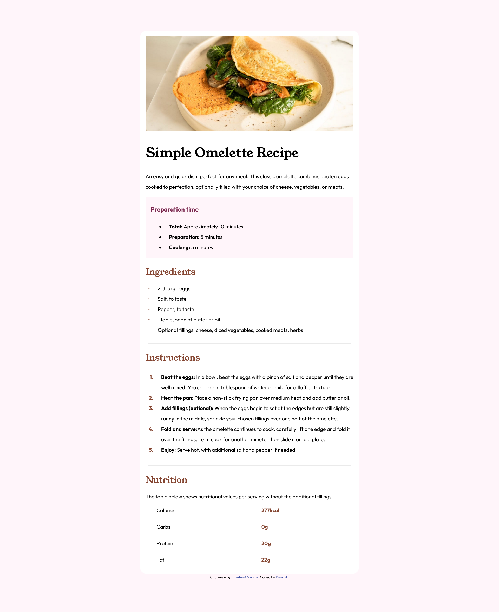
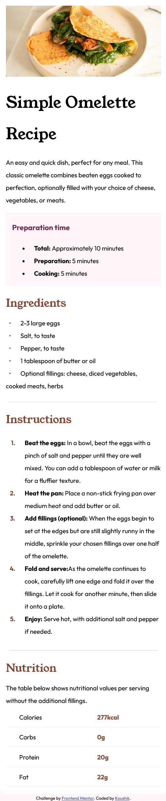

# Frontend Mentor - Recipe page solution

This is a solution to the [Recipe page challenge on Frontend Mentor](https://www.frontendmentor.io/challenges/recipe-page-KiTsR8QQKm). Frontend Mentor challenges help you improve your coding skills by building realistic projects.

## Table of contents

- [Overview](#overview)
  - [Screenshot](#screenshot)
  - [Links](#links)
- [Built with](#built-with)
- [Author](#author)

## Overview

The challenge is to build out this recipe page and get it looking as close to the design as possible.

### Screenshot

### Links

- Solution URL: [github repo link](https://github.com/Koushik176/vite-react-recipe)
- Live Site URL: [live site link](https://koushik176.github.io/vite-react-recipe/)

### Built with

- Semantic HTML5 markup
- CSS custom properties
- Flexbox
- Mobile-first workflow
- [vite](https://vitejs.dev/) - Frontend Tool
- [React](https://reactjs.org/) - JS library

## Author

- Frontend Mentor - [@Koushik176](https://www.frontendmentor.io/profile/Koushik176)
